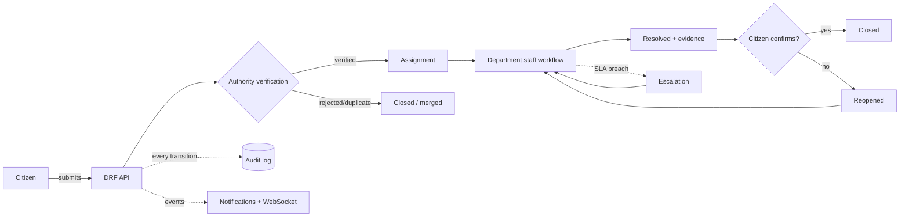
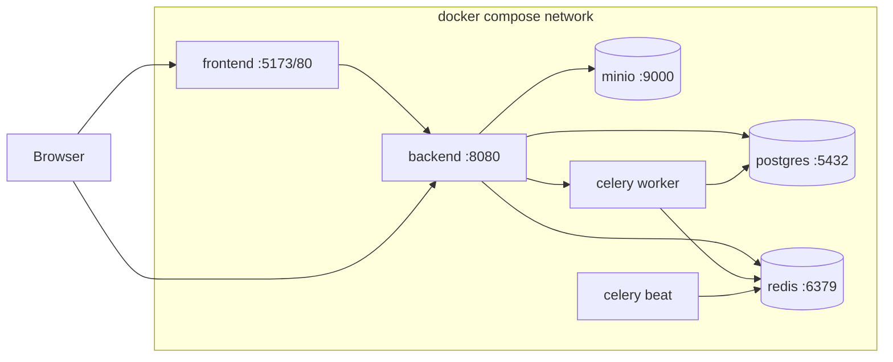

# SafeCity Architecture Diagram

> Render the Mermaid blocks in any Mermaid-compatible viewer (GitHub renders them natively).

## System context

See `docs/ARCHITECTURE.md` §1.1 (C4 context diagram).

## Incident lifecycle

## Deployment (Docker Compose, local)

## Deployment (AWS/EKS)

See `docs/ARCHITECTURE.md` §12 (AWS architecture flowchart).
