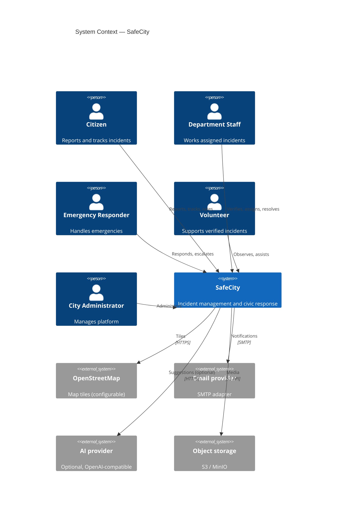
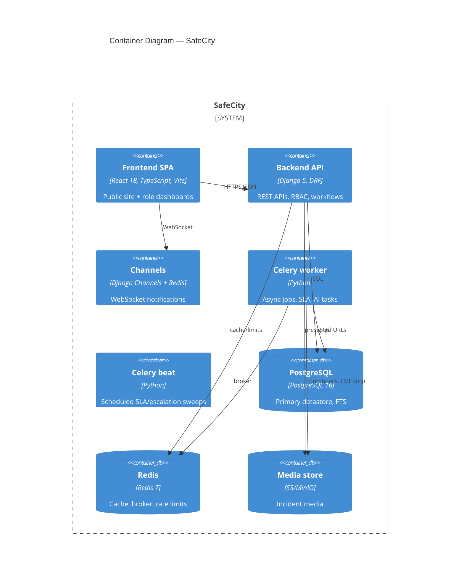
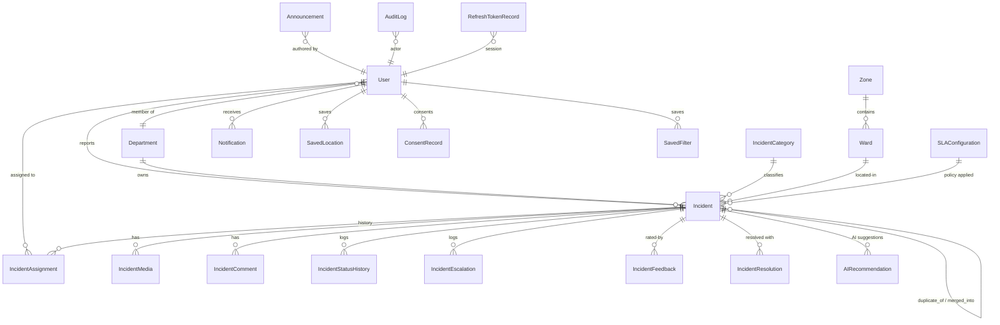
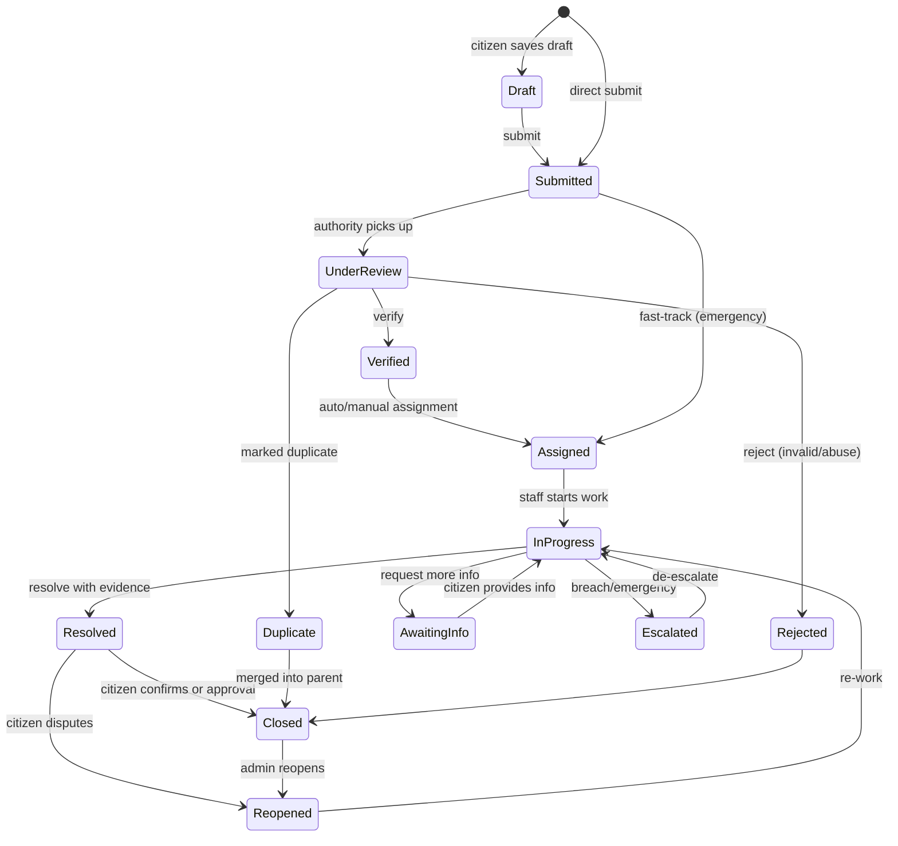
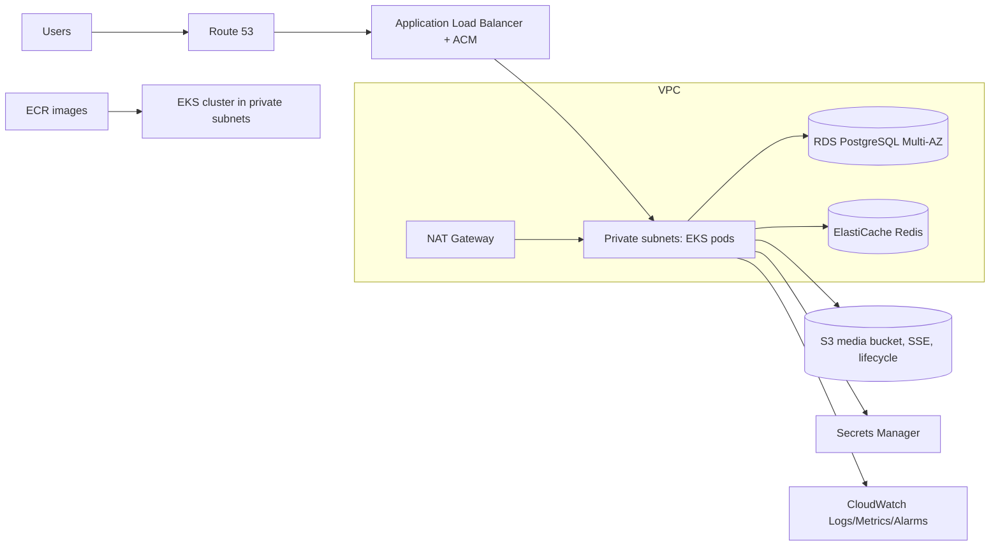

# SafeCity — Architecture Proposal

**Smart City Incident Management and Civic Response Platform**
SDP Project — The Bombay Salesian Society

> Status: Phase 1 (Architecture) — approved baseline for implementation.
> Constraint honored: SafeCity is an **incident coordination tool**, not an official
> emergency service and not an officially integrated government system. The UI and
> docs state this explicitly.

---

## 1. Final Architecture Proposal

### 1.1 System context

SafeCity is a monorepo web application with:

- **React SPA frontend** (public pages + authenticated role dashboards).
- **Django REST Framework API backend** (business logic, authorization, workflow).
- **PostgreSQL** (primary datastore; full-text search; optional PostGIS).
- **Redis** (cache, Celery broker, rate limiting, Channels layer).
- **Celery worker + beat** (async media processing, SLA checks, escalations, digests).
- **S3-compatible object storage** (media; MinIO locally, Amazon S3 in production).
- **WebSocket layer** (Django Channels → real-time notifications and dashboards).



### 1.2 Container view



### 1.3 Key architectural decisions

| # | Decision | Rationale |
|---|----------|-----------|
| D1 | Django + DRF monolith (modular apps) | Right-sized for SDP scale; a single deployable unit with clear app boundaries is easier to explain, test, and operate than microservices. |
| D2 | JWT access (15 min) + rotating refresh (7 days, rotation + blacklist) | Stateless API auth for SPA + mobile-friendly; rotation limits stolen-token window; simplejwt provides the machinery. |
| D3 | Service layer (`apps/*/services/`) | ViewSets stay thin; state-changing workflows (verify/assign/escalate/merge/reopen) run in transactions, emit audit logs, notifications, and SLA updates in one place. |
| D4 | Lat/long (decimal) + B-tree + GIST-style indexes via `btree` on rounded cells; PostGIS optional | Avoids hard dependency on PostGIS buildpacks; a `GeoService` abstraction (haversine nearby lookup + geohash cells) covers clustering/heatmaps; swap to PostGIS later without API change. |
| D5 | Media via presigned direct upload, backend-validated | Large videos never pass through Django; validation via content-type + magic bytes + Pillow; EXIF strip + thumbnails in Celery. |
| D6 | AI strictly advisory | `AIRecommendation` rows record provider, output, confidence, and human decision (`accepted/edited/rejected`). No workflow transition is ever caused by AI alone. |
| D7 | Everything degrades gracefully | Missing S3 → local filesystem storage; missing email → console backend; missing AI → `MockAIProvider`; missing SMS → no-op adapter. The app must run with `docker compose up` and zero cloud credentials. |
| D8 | Privacy by construction | Public serializers strip reporter identity, phones, emails, exact residential coordinates (jittered to ~150 m), and internal notes. Public tracking pages use unguessable UUIDv4 tokens, not reference numbers alone. |
| D9 | Audit-first | `AuditLog` written in the same transaction as every state change; superuser cannot bypass it (enforced in the service layer, not views). |
| D10 | UUID PKs, soft-delete on incidents | Non-guessable IDs for public surface; soft delete preserves audit integrity and allows "restore" by admins. |

---

## 2. Technology Justification

| Layer | Choice | Why (and why not alternatives) |
|-------|--------|-------------------------------|
| Backend | Python 3.12 + Django 5 + DRF | Batteries-included admin (free superuser UI for the SDP demo), mature auth/RBAC story, ORM + migrations, first-class testing. FastAPI would need far more assembly for admin, permissions, and migrations. |
| Realtime | Django Channels + Redis channel layer | Same process language as the API; Redis as backend is already required for Celery. |
| Async jobs | Celery + beat | Standard, battle-tested; beat covers SLA sweeps, escalation countdowns, duplicate re-checks. |
| Database | PostgreSQL 16 (+ optional PostGIS) | Full-text search (`tsvector`), JSONB, rich indexing, RDS support. |
| Auth | djangorestframework-simplejwt | Access/refresh with rotation, blacklist, custom claims for roles. |
| API docs | drf-spectacular | Generates OpenAPI 3 from serializers; Swagger UI + Redoc wired at `/api/schema/swagger/` and `/api/schema/redoc/`. |
| Frontend | React 18 + TypeScript + Vite | Fast dev server, typed contracts against OpenAPI; Vite is the current mainstream choice over CRA. |
| UI | Tailwind CSS + shadcn/ui-style primitives + Radix behavior | Accessible primitives (focus traps, ARIA) without a heavy design system lock-in; professional civic look is easy with Tailwind tokens. |
| Data | TanStack Query + React Hook Form + Zod | Server-state cache/invalidation for dashboards; forms with schema validation mirrored from the backend contract. |
| Maps | Leaflet + OpenStreetMap tiles (+ `leaflet.markercluster`, `leaflet.heat`) | Free, no API key, privacy-friendly; provider kept configurable via env. |
| Charts | Recharts | React-native API, small bundle; adequate for admin analytics. |
| E2E | Playwright | Cross-browser, stable selectors, trace viewer, runs in CI with `--reporter=line`. |
| Lint/format | Ruff (py), ESLint+Prettier (ts) | One fast Python tool replaces flake8/isort/black compatibility needs. |
| Scan | Trivy | Docker image + filesystem scanning in CI; simple `trivy image --exit-code 1`. |
| IaC | Terraform + AWS EKS/RDS/ElastiCache/S3/ALB | Required by the brief; modules keep envs DRY; S3 remote state + DynamoDB lock. |

---

## 3. Complete Feature List

**Auth & users:** register (citizen), login/logout, JWT access+refresh with rotation & blacklist, password reset, email-verification structure (token tables + console email), profile & privacy settings, consent records, account-deletion requests, failed-login lockout/throttling, session (refresh-token) invalidation, optional TOTP-2FA architecture for admins (flag-gated).

**Incidents:** 7-step submission wizard; draft support; anonymous reporting (config-gated); media upload (images/video/documents) with type/size validation, EXIF removal, thumbnails, progress + drag-and-drop + camera capture; duplicate warning via similarity check; reference numbers `SC-MUM-2026-XXXXXX`; SLA deadlines per category/severity; status workflow with allowed-transition matrix; verify/reject/assign/reassign/transfer/escalate/merge/reopen/close/resolve; resolution summary + evidence; citizen confirmation + satisfaction rating; comments (public/internal); public/private timelines; similar & related incidents; public shareable tracking link; PDF export interface.

**Dashboards:** authority operations dashboard (KPIs, queues, critical panel, workload, heatmap, date/ward filters, exports), citizen dashboard (active/resolved reports, status cards, search, notifications, feedback history, saved locations, quick report), public landing/map/announcements.

**Maps:** clustered markers, heatmap, category/severity/status/date/ward filters, geolocation, popups, public approximate coordinates (jitter), authority exact coordinates, nearby-incident lookup.

**Workflow:** category→department routing, auto-assignment (workload-aware), priority queue, SLA deadlines + breach flags, escalation rules + countdown, approval-before-close, reopen workflow, duplicate/merge workflow, verification workflow, emergency mode (red banner, emergency queue, responder assignment, action log, rate limits).

**Notifications:** in-app + WebSocket; adapters for email (SMTP/console), SMS (interface), push (architecture stub); per-user preferences; triggers for submission/verification/assignment/status/info-request/escalation/resolution/reopen/announcement/SLA-breach.

**Search/filter:** backend full-text (Postgres tsvector), reference, category, status, severity, department, assignee, ward, date range, SLA state; saved filters for authority users; pagination, sorting, ordering.

**Analytics:** incidents over time, by category/zone/department/status, response & resolution times, SLA compliance, staff workload, peak periods, reopen rate, satisfaction, duplicate rate, emergency rate; CSV export; PDF report structure; role-scoped access.

**Community:** public announcements, verified feed, moderated comments, satisfaction ratings, privacy-safe public statistics.

**AI (optional, advisory):** category/severity/priority suggestion, duplicate similarity, summarization, toxicity check, translation adapter (en/hi/mr), entity extraction; mock provider; provider interface for OpenAI-compatible endpoints; privacy scrub before external calls; confidence + human decision recorded.

**Ops:** JSON structured logs with request IDs, `/api/health/` + `/api/readiness/` (DB + Redis + storage checks), OpenAPI docs, rate limiting, CORS allowlist, security headers, CSP, audit log UI, seed command, fixtures, Docker/K8s/Terraform/CI as detailed below.

---

## 4. Role–Permission Matrix

Server-enforced via DRF permission classes + per-object checks in services. Frontend checks are UX only.

| Capability | Citizen | Dept Staff | Emergency Responder | Volunteer | City Admin | Superuser |
|---|:-:|:-:|:-:|:-:|:-:|:-:|
| Register / login | ✅ | ✅ | ✅ | ✅ | ✅ | — (provisioned) |
| Create incident | ✅ | ✅* | — | — | ✅ | ✅ |
| Anonymous report | ✅ (config) | ✅* | — | — | ✅ | ✅ |
| View own incidents | ✅ | ✅ | ✅ | — | ✅ all | ✅ all |
| View department incidents | — | ✅ dept | ✅ high-priority | ✅ approved/community | ✅ all | ✅ all |
| Verify / reject incident | — | — | — | — | ✅ | ✅ |
| Update status | — | ✅ dept-assigned | ✅ own assignments | — | ✅ | ✅ |
| Assign / reassign | — | ✅ within dept | — | — | ✅ cross-dept | ✅ |
| Escalate | — | ✅ | ✅ | — | ✅ | ✅ |
| Merge duplicates | — | — | — | — | ✅ | ✅ |
| Reopen | ✅ (own, via request) | ✅ | — | — | ✅ | ✅ |
| Close (after approval) | — | ✅ | — | — | ✅ | ✅ |
| Internal notes | — | ✅ | ✅ | — | ✅ | ✅ |
| Public updates / comments | ✅ own reports | ✅ | ✅ | ✅ observations | ✅ | ✅ |
| Confirm resolution | ✅ own | — | — | — | ✅ | ✅ |
| Satisfaction rating | ✅ own | — | — | — | — | — |
| View analytics | — | ✅ dept-scoped | ✅ limited | — | ✅ all | ✅ all |
| Manage users/roles | — | — | — | — | ✅ | ✅ |
| Manage categories/departments/SLA/settings | — | — | — | — | ✅ | ✅ |
| Announcements (manage) | — | — | — | — | ✅ | ✅ |
| Audit logs | — | — | — | — | ✅ read | ✅ read |
| Bypass audit logging | ❌ | ❌ | ❌ | ❌ | ❌ | ❌ |

\* Staff/admin-created incidents on behalf of walk-in citizens are attributed to a staff identity with a "reported via desk" flag, not anonymous.

**Institutional roles vs Django groups:** roles live on `User.role` (single primary role) + M2M `Group`s for composite permissions; `RolePermission` maps role→permission codenames; `has_object_permission` performs object-level checks (owner, department membership, assignment).

---

## 5. Database Model Plan (ER overview)



**Models (all UUID PKs, `created_at`/`updated_at`):**

| App | Models |
|-----|--------|
| `accounts` | `User`(custom, UUID, role, department FK, phone, privacy flags, failed-login counters, 2FA fields), `Department`(code, name, email, is_emergency), `Role`/`RolePermission` (via groups), `ConsentRecord`(type, version, granted_at), `DeletionRequest`, `SavedLocation`, `SavedFilter`, `RefreshTokenRecord` (whitelist for session invalidation) |
| `incidents` | `Incident`(reference_number unique, title, description, search_vector, category FK, subcategory, severity, urgency, status, reporter FK nullable-if-anon, is_anonymous, department FK, assigned_staff FK, assigned_responder FK, lat/lng, address_public, address_private, ward FK, landmark, is_emergency, sla_deadline, duplicate_of FK self, merged_into FK self, resolution fields, satisfaction rating, citizen_confirmed, timestamps for each transition, soft-delete), `IncidentCategory`(name, slug, icon, default_department FK, is_emergency, sla_hours), `IncidentMedia`(file, type, mime, size, checksum, thumbnail, exif_stripped, scan_status), `IncidentComment`(body, is_internal, author, moderation_status), `IncidentStatusHistory`(from, to, actor, note), `IncidentAssignment`(assignee, assigned_by, released_at), `IncidentEscalation`(level, reason, escalated_by, deadline), `IncidentResolution`(summary, evidence media, resolved_by, approved_by), `IncidentFeedback`(rating 1–5, comment, confirmed_resolution), `AIRecommendation`(kind, provider, output JSON, confidence, decision, decided_by) |
| `notifications` | `Notification`(recipient, verb, incident FK nullable, payload JSON, read_at), `NotificationPreference`(channel switches), `Announcement`(title, body, audience, is_pinned, published_by) |
| `analytics` | `DailyIncidentAggregate`(date, ward, category, department: counts + durations) — maintained by Celery nightly task to keep dashboard queries O(1) |
| `audit` | `AuditLog`(actor, action, object_type, object_id, changes JSON, request_id, ip, user_agent, timestamp) — append-only, indexed |
| `core` (shared) | `Ward`, `Zone`, `SLAConfiguration`(category, severity, hours), `IntegrationConfiguration`(name, kind, enabled, settings JSON encrypted-at-rest note), `APIKey`(hashed, scopes, created_by) |

**Indexing:** b-tree on `status`, `severity`, `category_id`, `department_id`, `created_at`, `sla_deadline`, `(latitude, longitude)`; GIN on `search_vector`; unique on `reference_number`; partial index on un-read notifications.

---

## 6. API Endpoint Plan

Base: `/api/v1/` (versioned via URL path). OpenAPI at `/api/schema/`, Swagger UI `/api/schema/swagger/`, Redoc `/api/schema/redoc/`.

| Group | Endpoints |
|-------|-----------|
| Auth | `POST /auth/register/`, `POST /auth/token/`, `POST /auth/token/refresh/`, `POST /auth/token/blacklist/` (logout), `POST /auth/password/reset/`, `POST /auth/password/reset/confirm/`, `GET/PATCH /auth/me/`, `GET /auth/sessions/`, `DELETE /auth/sessions/{id}/`, `POST /auth/verify-email/` |
| Users | `GET/POST /users/`, `GET/PATCH/DELETE /users/{id}/`, `POST /users/{id}/role/`, `GET /users/staff/` (for assignment pickers) — admin only |
| Departments | `GET /departments/`, `POST/PATCH` (admin), `GET /departments/{id}/workload/` |
| Categories / Wards | `GET /categories/`, admin CRUD; `GET /wards/`, `GET /zones/` |
| Incidents | `GET/POST /incidents/`, `GET/PATCH /incidents/{id}/`, `GET /incidents/{ref}/lookup/?q=` (public tracking), `POST /incidents/{id}/status/`, `/assign/`, `/escalate/`, `/merge/`, `/reopen/`, `/confirm/`, `/feedback/`, `/comments/`, `/media/`, `/similar/`, `/watchers/`, `GET /incidents/{id}/timeline/`, `GET /incidents/public/{token}/` (share link), `GET /incidents/{id}/export.pdf/` |
| Notifications | `GET /notifications/`, `POST /notifications/{id}/read/`, `POST /notifications/read-all/`, `GET/PATCH /notifications/preferences/` |
| Analytics | `GET /analytics/summary/`, `/analytics/trends/`, `/analytics/by-category/`, `/analytics/by-ward/`, `/analytics/by-department/`, `/analytics/sla/`, `/analytics/staff-workload/`, `GET /analytics/export.csv/` |
| Announcements | `GET /announcements/` (public), admin CRUD |
| Audit | `GET /audit-logs/` (admin), filterable |
| Ops | `GET /health/`, `GET /readiness/`, `GET /meta/config/` (public runtime config: map tiles, emergency banner, categories) |
| AI | `POST /incidents/{id}/ai/suggest/` (staff), `POST /incidents/duplicates/check/` (during wizard), `POST /ai/decide/{recommendation_id}/` |

**Conventions:** cursor or page-number pagination (`page_size` ≤ 100); filtering via query params; consistent error envelope `{"detail": str, "code": str, "errors": {...}}`; request IDs via `X-Request-ID`; rate limits per group (anon: 30/min on submissions & auth; citizen: 5 incidents/hour; staff: generous); JWT in `Authorization: Bearer` (SPA), refresh rotation with blacklist detection.

---

## 7. Frontend Page & Component Plan

**Public:** Landing, About, Public map, Public incident tracking (`/track/:reference`), Announcement list/detail, Login, Register, Forgot/Reset password.

**Citizen:** Dashboard, Create incident (7-step wizard), My incidents, Incident detail (with tabs: timeline/media/comments), Notifications, Profile & privacy, Feedback.

**Authority:** Operations dashboard, Incident queue (table + saved filters), Incident detail + workflow panel (verify/assign/escalate/merge/reopen/resolve/close, internal notes), Map operations view, Assignment management, Department workload, Analytics, Reports, Announcements management, User management, Audit logs, System settings, Emergency mode view.

**Component library (`src/components/ui/`):** Button, Input, Select, Textarea, Checkbox, Radio, Badge, Card, Dialog, Drawer, Dropdown, Tabs, Table, Toast/Toaster, Skeleton, EmptyState, ErrorState, Spinner, Avatar, Tooltip, Timeline, StatCard, FileDropzone, MapView (cluster + heat), StatusBadge, SeverityBadge, ReferenceChip, ConfirmDialog, RangeDatePicker.

**Layouts:** `PublicLayout`, `CitizenLayout`, `AuthorityLayout` (sidebar + topbar + emergency banner), `AuthLayout`.

**State:** TanStack Query for server state (keys `['incidents', filters]` etc.), Zustand for UI state (auth user, theme, sidebar), Zod schemas in `src/lib/schemas` mirroring API payloads.

---

## 8. Incident State-Transition Diagram



**Transition rules** live in `incidents/services/transitions.py` as a declarative matrix `{(from, to): (allowed_roles, preconditions, side_effects)}`; violations return 409 with machine-readable code.

---

## 9. Repository Tree

```
safecity/
├── frontend/                    # React SPA
│   ├── src/{api,components,features,layouts,pages,hooks,routes,services,store,types,utils,lib}
│   ├── tests/ (vitest + RTL)  e2e/ (playwright)
│   ├── public/  Dockerfile  nginx.conf  vite.config.ts  tailwind.config.ts
├── backend/
│   ├── config/ (settings/{base,dev,prod,test}.py, urls.py, asgi.py, celery.py, wsgi.py)
│   ├── apps/{core,accounts,incidents,notifications,analytics,departments,announcements,audit,ai}
│   ├── requirements/{base,dev,prod}.txt
│   ├── tests/ (pytest)  Dockerfile  manage.py  pytest.ini
├── infrastructure/
│   ├── terraform/{modules/{network,eks,rds,elasticache,s3,ecr,iam,cloudwatch,alb,secrets},
│   │              environments/{dev,staging,prod}}
│   ├── kubernetes/{base,overlays/{dev,staging,production}}
│   └── helm/safecity/
├── .github/{workflows,ISSUE_TEMPLATE,PULL_REQUEST_TEMPLATE.md,CODEOWNERS}
├── docs/  scripts/  docker-compose.yml  docker-compose.prod.yml  Makefile
├── README.md  CONTRIBUTING.md  SECURITY.md  LICENSE  .env.example  .gitignore
└── architecture-diagram.md
```

---

## 10. Docker Architecture

Development: `docker-compose.yml` runs `db` (Postgres), `redis`, `minio`, `backend` (runserver + autoreload), `celery`, `celery-beat`, `frontend` (Vite dev server, hot reload). Source mounted as volumes.

Production-like: `docker-compose.prod.yml` builds multi-stage images; backend runs gunicorn (async workers) + daphne for WS; frontend builds static assets → nginx serves SPA + `/api/` reverse proxy; healthchecks on every service; named volumes for pgdata; entrypoint runs `migrate --check` guard, not auto-migrate (explicit `make migrate`).

Every container: non-root user, pinned base image, `HEALTHCHECK`, no secrets baked in.

---

## 11. Kubernetes Architecture

Helm chart `infrastructure/helm/safecity` with values per env (`values-dev/staging/prod.yaml`): Deployments `backend`, `frontend`, `celery-worker`, `celery-beat`; Services; Ingress (ALB annotations for EKS, nginx for local k3d); HPA on CPU + queue-depth metric; PDBs; ServiceAccount with IRSA annotations for S3/Secrets; NetworkPolicies (frontend→backend, backend→db/redis only); probes: startup (migrations-not-required), readiness (`/api/readiness/`), liveness (`/api/health/`); resource requests/limits; securityContext (runAsNonRoot, readOnlyRootFilesystem, drop ALL caps); ConfigMap + Secret **templates** only; Kustomize overlays mirror Helm values for teams preferring plain manifests.

---

## 12. AWS Architecture



Cost-conscious defaults: single NAT (documented multi-AZ upgrade), RDS `db.t4g.micro` dev / `db.t4g.medium` prod, ElastiCache `cache.t4g.micro`, EKS 2×`t3.medium` spot-capable nodes dev, 3×on-demand prod, S3 lifecycle → IA at 90 days. A `COST-CONTROL.md` documents destroy order and budget alarms.

---

## 13. Terraform Module Plan

Modules: `network` (VPC, subnets, NAT, SGs), `ecr`, `eks` (+IRSA), `rds`, `elasticache`, `s3`, `iam` (least-privilege task roles), `cloudwatch` (log groups, alarms, dashboards), `alb` (+ACM/Route53 interface), `secrets` (Secrets Manager entries). Environments `dev/staging/prod` consume modules with tfvars; remote state: S3 + DynamoDB lock (backend config example provided, not applied); every resource tagged `{Project: safecity, Environment, Owner, CostCenter}`; sensitive variables marked `sensitive = true`; `terraform fmt -check` and `validate` pass in CI.

---

## 14. GitHub Actions Plan

| Workflow | Trigger | Jobs |
|----------|---------|------|
| `backend-ci.yml` | PR → develop/main | ruff, pytest (Postgres/Redis services), coverage ≥ 80% gate |
| `frontend-ci.yml` | PR | eslint, tsc, vitest, build |
| `docker-ci.yml` | PR/main | build images, Trivy scan (fail HIGH/CRITICAL), push to ECR on main (OIDC, no long-lived keys) |
| `terraform-ci.yml` | PR (infra paths) | fmt -check, validate, plan (dev) with plan artifact |
| `k8s-validate.yml` | PR | helm lint, kubeconform |
| `deploy-staging.yml` | merge to develop | build→push→helm upgrade staging (environment: staging) |
| `deploy-production.yml` | tag `v*` | **protected GitHub environment `production` (manual approval)** → helm upgrade prod |
| `e2e.yml` | nightly + PR label | compose up → Playwright suite |

PR templates, issue templates (bug/feature), CODEOWNERS, branch protection documented (main: PR + approvals + status checks; develop: PR).

---

## 15. Testing Plan

- **Backend:** pytest + pytest-django + factory_boy. Cover: registration/login flows, JWT rotation & blacklisting, lockout, RBAC matrix (parametrized over roles × endpoints), incident CRUD + validation, media validation (bad MIME, oversize, EXIF), assignment rules + workload-aware auto-assign, transition matrix incl. forbidden transitions, SLA deadline computation + breach flagging + beat sweep, escalation, duplicate detection, comments visibility (internal vs public), notifications fan-out, analytics endpoints (role scoping), audit log writes, rate limiting, anonymous reporting, privacy-safe public serializer snapshot tests.
- **Frontend:** Vitest + RTL — login form, wizard validation, role-based route guards, dashboard renders, incident status update, notification toast, error/loading states; MapView mocked.
- **E2E (Playwright):** the full citizen→authority→staff→resolution→feedback loop against seeded compose stack.
- Coverage target: **backend ≥ 80%**, **frontend ≥ 70%** statements on `src/`. Commands documented in Makefile (`make test`, `make test-frontend`, `make test-e2e`).

---

## 16. Security & Privacy Plan

AuthN: Argon2-compatible password hashing (Django default PBKDF2 with high iterations; Argon2 if package present), JWT 15 min/7 d rotation + blacklist, refresh whitelist for device sessions. AuthZ: RBAC + object-level checks server-side. Rate limits (auth, submission, upload, AI). Brute-force lockout with exponential backoff. Input: serializer validation + Zod mirror; uploads: extension + content-type + magic bytes + Pillow verify + size caps (image 10 MB, video 100 MB, doc 5 MB) + ClamAV adapter interface (no-op mock locally). XSS: React escaping, no `dangerouslySetInnerHTML`, CSP header with nonce strategy, sanitize announcement HTML server-side. CSRF: JWT-in-header for API (stateless), session auth for Django admin with CSRF middleware. CORS strict allowlist from env. Headers: HSTS, X-Content-Type-Options, Referrer-Policy, Permissions-Policy, X-Frame-Options DENY. Secrets: env only, `.env` gitignored, K8s Secrets as templates, AWS Secrets Manager in prod. Privacy: public serializers redact PII; map jitter ≥150 m for residential public views; audit logs immutable; retention job (closed incidents anonymized after N months, configurable); consent + deletion-request workflow; no PII to external AI (scrub + mock default).

---

## 17. SDP Documentation Plan

`docs/` will contain (numbered to match §18 of the brief): overview, problem statement, objectives, scope, stakeholders, FRs, NFRs, roles, use cases, user stories, architecture (this doc), ER diagram, API spec (generated + narrative), wireframes, security design, privacy & governance, DevOps, Docker guide, K8s guide, AWS architecture, Terraform guide, CI/CD, testing strategy, monitoring, backup/DR, risk register, cost estimation, milestones, maintenance, limitations, future work, demo script, viva Q&A, installation guide, user manual, administrator manual. Mermaid diagrams throughout.

---

## 18. Development Milestones

| Phase | Deliverable | Gate |
|-------|-------------|------|
| 1 | Architecture (this doc) | ✅ |
| 2 | Repo scaffold, tooling, git | builds empty-clean |
| 3 | Models + migrations + admin | `migrate` clean |
| 4 | Auth + RBAC | auth tests pass |
| 5 | Incident APIs + workflow | API tests pass, OpenAPI renders |
| 6 | Frontend shell + design system | routes render, lint clean |
| 7 | Citizen reporting | E2E submit happy path |
| 8 | Authority dashboard | workflow panel functional |
| 9 | Maps/analytics/notifications/AI | dashboards live |
| 10 | Test suites | coverage gates met |
| 11 | Docker | `docker compose up` demo-ready |
| 12 | K8s/Helm | helm lint + kubeconform pass |
| 13 | Terraform | fmt/validate pass, no apply |
| 14 | CI/CD | all workflows green on PR |
| 15 | Security review | checklist complete |
| 16 | Docs | SDP package complete |

---

## 19. Risks and Mitigations

| Risk | Likelihood | Impact | Mitigation |
|------|-----------|--------|------------|
| Scope exceeds timeline (SDP) | High | High | Phase gates; mock adapters so every feature degrades; demo data early |
| PostGIS unavailable locally | Medium | Medium | Lat/lng + index abstraction; PostGIS optional via env flag |
| WebSocket complexity in prod (ALB) | Medium | Medium | In-app notification polling fallback; daphne behind ALB with idle timeout tuned |
| Cost surprises in AWS | Medium | High | Dev-size defaults, budget alarm doc, `destroy` runbook, nothing auto-provisions |
| AI privacy leaks | Low | High | Scrub layer, mock default, opt-in env, no PII by default |
| Duplicate detection false positives | Medium | Medium | Threshold-tuned similarity, human confirm required |
| Large media abuse | Medium | Medium | Size/type caps, rate limits, scan adapter, private bucket + presigned URLs |
| Token theft | Low | High | Short access TTL, rotation, blacklist, IP/UA session listing |

---

## 20. Assumptions

1. Academic SDP context: single-region deployment, modest traffic (<10k incidents/month), demo-oriented but production-style code.
2. Mumbai wards/zones are **illustrative seed data**, clearly labeled non-authoritative.
3. No official government integration claimed or implemented; all external systems are adapters.
4. Email/SMS/AI/storage credentials are optional; app is fully functional with mocks.
5. English UI at launch; translation adapter prepared for en/hi/mr.
6. JWT SPA model (Authorization header) — no cookie-based API auth; Django admin remains session/CSRF.
7. Infrastructure code is delivered but **never executed** without explicit user approval (per constraints).
8. Browsers: last 2 versions Chrome/Edge/Firefox/Safari; mobile responsive down to 360 px.
