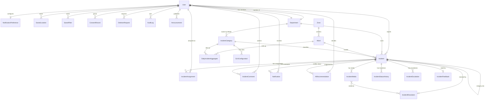

# SafeCity — Data Model

All models inherit `UUIDModel` (`apps/core/models.py`): a UUID primary key plus
`created_at` / `updated_at`. UUID keys keep public identifiers unguessable and let the
public surface expose records without leaking volume or creation order.

Primary keys are UUIDv4 except where a natural key is genuinely stable
(`Zone.code`, `Ward.code`, `Department.code`, `ReferenceCounter.prefix`).

---

## 1. Entity-relationship diagram

`IncidentResolution.evidence` is a `ManyToManyField` to `IncidentMedia`, so a single
piece of media can support a resolution without duplication. `SLAConfiguration` links to
`IncidentCategory` (with a null category row acting as the global fallback).

---

## 2. Entity dictionary

### 2.1 `accounts`

#### `User` (custom, `AUTH_USER_MODEL`)

Email is the login identifier (`USERNAME_FIELD = "email"`, unique, indexed, lowercased
by the manager).

| Field | Type | Notes |
|-------|------|-------|
| `id` | UUID PK | |
| `email` | EmailField unique | Login identifier |
| `first_name`, `last_name` | CharField(80) | Blank allowed |
| `phone` | CharField(20) | Blank allowed; never exposed publicly |
| `role` | CharField(30), indexed | One of the six `UserRole` values; default `citizen` |
| `department` | FK → `Department`, null | Staff/responder scoping; `SET_NULL` on delete |
| `is_staff`, `is_active` | Boolean | Django admin access / account enabled |
| `prefers_anonymous_reporting` | Boolean | Pre-selects anonymous in the wizard |
| `marketing_consent` | Boolean | Distinct from required consent |
| `language` | CharField(8) | `en` / `hi` / `mr` |
| `failed_login_count` | PositiveInteger | Brute-force counter |
| `locked_until` | DateTime, null | Lockout expiry |
| `two_factor_enabled`, `two_factor_secret` | Boolean / CharField | Optional TOTP structure |
| `email_verified_at` | DateTime, null | Verification state |
| `deleted_at` | DateTime, null | Soft-deletion marker |
| `password` | — | Hashed by Django; never stored or logged raw |

Methods: `full_name`, `is_authority()`, `soft_delete()`.

`soft_delete()` deactivates the account, anonymizes name/phone/email to
`deleted-<uuid>@safecity.invalid`, and sets an unusable password. Foreign keys from
`AuditLog` and others survive because the row is retained.

Indexes: `(role)`, `(department)`.

#### `Department`

| Field | Type | Notes |
|-------|------|-------|
| `name` | CharField(120) unique | e.g. "Water Department" |
| `code` | SlugField(20) unique | e.g. `water` |
| `description` | Text | |
| `contact_email`, `contact_phone` | — | Blank allowed |
| `is_emergency_department` | Boolean | Fire, Law & Order, Disaster Management |
| `is_active` | Boolean | |

#### `ConsentRecord`

Immutable consent grant: `user`, `kind` (`terms`/`privacy`/`data_processing`/`marketing`),
`version`, `granted_at`, `revoked_at`, `ip_address`. Indexed on `(user, kind)`.

#### `DeletionRequest`

`user`, `reason`, `status` (`pending`/`processing`/`completed`/`rejected`, indexed),
`processed_by`, `processed_at`.

#### `SavedLocation`

`user`, `label`, `latitude`/`longitude` (decimal 9,6), `address`, `is_default`.
A partial unique constraint (`uniq_default_saved_location_per_user`) permits at most one
default location per user.

#### `SavedFilter`

`user`, `name`, `querystring` (max 1000 chars). Unique on `(user, name)`.

---

### 2.2 `core`

| Model | Key fields | Notes |
|-------|-----------|-------|
| `Zone` | `name` unique, `code` unique | Illustrative municipal grouping |
| `Ward` | FK `zone` (PROTECT), `name`, `code` unique, `latitude`/`longitude` nullable | Indexed on `zone` |
| `SLAConfiguration` | FK `category` (nullable = default rule), `severity`, `response_hours` (24), `resolution_hours` (72), `is_active` | Partial unique constraint `(category, severity)` where active |
| `IntegrationConfiguration` | `name` slug unique, `kind`, `enabled`, `settings` JSON, `updated_by` | Toggle/settings for email, SMS, push, AI, scanning, captcha, map tiles, storage |
| `APIKey` | `name`, `key_hash` unique, `scopes` JSON, `is_active`, `created_by`, `last_used_at` | Only the SHA-256 hash is stored; the raw key is shown once |

`SLAConfiguration.category` being nullable is deliberate: one null-category row acts as
the fallback rule for every category without its own row.

---

### 2.3 `incidents`

#### `IncidentCategory`

`name` unique, `slug` unique, `description`, `icon`, `default_department` FK,
`is_emergency_category`, `requires_media`, `is_active`, `display_order`
(ordered by `display_order`, then `name`).

#### `Incident` — the central aggregate

| Group | Fields |
|-------|--------|
| Identity | `reference_number` (CharField(32), unique, indexed) — `SC-MUM-<YEAR>-000001` |
| Content | `title` (160), `description`, `subcategory` |
| Classification | `category` FK (PROTECT), `severity` (indexed), `urgency` |
| Status | `status` (indexed), default `submitted` |
| People | `reporter` FK (null → anonymous), `is_anonymous`, `department` FK, `assigned_staff`, `assigned_responder` |
| Location | `latitude`, `longitude` (decimal 9,6), `address_public`, `address_private`, `ward` FK, `landmark` |
| Workflow | `is_emergency` (indexed), `sla_deadline` (indexed), `sla_breached`, `duplicate_of` (self-FK), `merged_into` (self-FK), `citizen_confirmed_resolution`, `satisfaction_rating` (1–5), `resolution_summary` |
| Trail | `submitted_at`, `verified_at`, `assigned_at`, `resolved_at`, `closed_at` |
| Search | `search_vector` (`SearchVectorField`) |
| Deletion | `deleted_at` (soft delete) |

`category` uses `PROTECT`: deleting a category that has incidents is refused, preserving
historical classification.

Declared model permissions: `verify_incident`, `assign_incident`, `escalate_incident`,
`merge_incident`, `view_internal_timeline`, `view_all_analytics`.

Indexes: `status`, `severity`, `category`, `department`, `ward`, `created_at`,
`sla_deadline`, `(latitude, longitude)`, `is_emergency`, plus a **GIN index** on
`search_vector` for full-text search.

Derived properties (not stored): `is_overdue`, `response_time`, `resolution_time`.

##### Reference number allocation

`allocate_reference_number(prefix)` runs inside the calling transaction:

1. `get_or_create` the `ReferenceCounter` row for the prefix (tolerating the race where
   two workers both find nothing).
2. `SELECT … FOR UPDATE` the row.
3. Increment, save, and format zero-padded to six digits.

The row lock is held until the surrounding transaction commits, so the counter
increment and the `Incident` insert commit together. This is a table rather than a
Postgres sequence so the counter stays inspectable, resettable per year, and portable
across database backends.

An explicitly supplied `reference_number` (fixtures, imports, tests) is preserved.

#### `IncidentMedia`

`incident` FK, `file` (`upload_to="incidents/%Y/%m/"`), `media_type`
(`image`/`video`/`document`), `mime_type`, `size_bytes`, `original_filename`,
`thumbnail`, `caption`, `uploaded_by`, `exif_stripped`, `scan_status`
(`pending`/`clean`/`infected`/`skipped`).

#### `IncidentComment`

`incident` FK, `author` FK (null allowed), `body`, `is_internal` (indexed),
`moderation_status` (`visible`/`flagged`/`hidden`).

`is_internal = True` marks an authority-only note; visibility is enforced by
`can_view_internal_notes()` and the serializers.

#### `IncidentStatusHistory`

`incident` FK, `from_status` (nullable — the initial transition has none), `to_status`,
`actor` FK, `note` (500), `is_public` (default true). Ordered oldest-first to form the
timeline.

#### `IncidentAssignment`

`incident` FK, `assignee` FK, `assigned_by` FK, `released_at`, `note`. Ordered
newest-first; retains history across reassignment.

#### `IncidentEscalation`

`incident` FK, `level` (`level_1` supervisor / `level_2` department head /
`level_3` emergency operations), `reason`, `escalated_by`, `resolved_at`.

#### `IncidentResolution` (one-to-one)

`incident` (OneToOne), `summary`, `evidence` (M2M → `IncidentMedia`), `resolved_by`,
`approved_by`, `approved_at`.

#### `IncidentFeedback` (one-to-one)

`incident` (OneToOne), `user`, `rating` (nullable 1–5 — a citizen may confirm without
rating), `comment`, `confirmed_resolution`.

#### `ReferenceCounter`

`prefix` (CharField(24), primary key), `last_value`. One row per reference prefix.

---

### 2.4 `notifications`

#### `Notification`

`recipient` FK, `verb` (machine-readable event key, max 50), `title` (160), `body`,
`incident` FK (nullable), `payload` JSON, `read_at` (indexed). Indexed on
`(recipient, read_at)` — this supports the "unread for this user" query, which is the
hot path.

#### `NotificationPreference` (one-to-one with user)

Channel switches `in_app` (true), `email` (true), `sms` (false), `push` (false), plus
`events_enabled` JSON for per-event opt-outs, e.g. `{"status_change": false}`.

Channel defaults are asymmetric on purpose: in-app and email on, SMS and push off,
because the latter two require credentials the project does not assume.

---

### 2.5 `announcements`

#### `Announcement`

`title` (200), `body`, `audience` (`public`/`citizens`/`staff`), `is_pinned`,
`is_published`, `published_at`, `published_by`. Ordered by pinned first, then most
recently published. `publish(by=...)` stamps publication state.

---

### 2.6 `analytics`

#### `DailyIncidentAggregate`

One row per `(date, ward, category, department)` — enforced by the unique constraint
`uniq_daily_aggregate`.

Counters: `submitted_count`, `resolved_count`, `reopened_count`, `emergency_count`,
`duplicate_count`, `sla_met_count`, `sla_missed_count`.
Durations: `avg_response_minutes`, `avg_resolution_minutes`.
Satisfaction: `satisfaction_sum`, `satisfaction_n`, with a computed
`satisfaction_avg` property.

Storing a sum and a count rather than an average avoids the classic mistake of averaging
averages when rows are combined.

---

### 2.7 `audit`

#### `AuditLog` (append-only)

| Field | Notes |
|-------|-------|
| `actor` | FK → User, `SET_NULL` so the trail survives account deletion |
| `action` | e.g. `incident.status_change`, `ai.decision`; indexed |
| `object_type`, `object_id` | Generic target reference |
| `changes` | JSON diff |
| `request_id` | Correlates with the `X-Request-ID` response header |
| `ip_address`, `user_agent` | Request provenance |

Indexes: `(actor, -created_at)` and `(object_type, object_id)`.

Rows are written by `apps/audit/services.py` **inside the same transaction** as the
state change, so a committed state change can never lack its audit row. There is no
service path that mutates workflow state without calling `log_action`.

---

### 2.8 `ai`

#### `AIRecommendation`

`incident` FK (nullable), `kind` (category/severity/priority/duplicate/summary/
toxicity/translation/entities), `provider` (default `mock`), `output` JSON,
`confidence` (float, nullable), `decision` (`pending`/`accepted`/`edited`/`rejected`),
`decided_by`, `decided_at`. Indexed on `kind`.

`decided_by` and `decided_at` make every suggestion explainable after the fact: what was
proposed, how confident it was, and who chose what. No incident transition is ever
attributed to AI alone.

---

## 3. Enum reference

| Enum | Values |
|------|--------|
| `UserRole` | `citizen`, `department_staff`, `emergency_responder`, `volunteer`, `city_admin`, `superuser` |
| `IncidentStatus` | `draft`, `submitted`, `under_review`, `verified`, `rejected`, `duplicate`, `assigned`, `in_progress`, `awaiting_info`, `escalated`, `resolved`, `closed`, `reopened` |
| `Severity` | `low`, `medium`, `high`, `critical` |
| `Urgency` | `low`, `normal`, `urgent`, `immediate` |
| `IncidentMedia.TYPES` | `image`, `video`, `document` |
| `IncidentMedia.scan_status` | `pending`, `clean`, `infected`, `skipped` |
| `IncidentComment.moderation_status` | `visible`, `flagged`, `hidden` |
| `IncidentEscalation.LEVELS` | `level_1`, `level_2`, `level_3` |
| `NotificationPreference` channels | `in_app`, `email`, `sms`, `push` |
| `Announcement.AUDIENCES` | `public`, `citizens`, `staff` |
| `AIRecommendation.KINDS` | `category`, `severity`, `priority`, `duplicate`, `summary`, `toxicity`, `translation`, `entities` |
| `AIRecommendation.DECISIONS` | `pending`, `accepted`, `edited`, `rejected` |
| `DeletionRequest.STATUSES` | `pending`, `processing`, `completed`, `rejected` |
| `ConsentRecord.KINDS` | `terms`, `privacy`, `data_processing`, `marketing` |

Status strings are stored as `CharField` with `choices` rather than a native database
enum. That keeps adding a status a migration-only change and avoids the awkward
`ALTER TYPE` migration path on PostgreSQL.

---

## 4. Data integrity rules

| Rule | Enforced by |
|------|-------------|
| Reference numbers are unique and gap-free per prefix | Unique index + row-locked counter |
| One default saved location per user | Partial unique constraint |
| One active SLA rule per `(category, severity)` | Partial unique constraint |
| One aggregate row per `(date, ward, category, department)` | Unique constraint |
| A category with incidents cannot be deleted | `on_delete=PROTECT` |
| A zone with wards cannot be deleted | `on_delete=PROTECT` |
| Deleting a user preserves their audit trail | `on_delete=SET_NULL` on `AuditLog.actor` |
| Deleting a user preserves their incident's classification | `on_delete=SET_NULL` on `Incident.reporter` |
| Duplicate reports cannot be merged into a rejected parent | Service precondition in `merge_incident()` |
| Resolution requires a summary | `IncidentResolution.summary` is non-null; `change_status` requires `extra_updates` for `resolved` |

---

## 5. Migration strategy

- Schema is managed exclusively through Django migrations
  (`apps/*/migrations/`). No manual DDL.
- Migrations are applied explicitly (`make migrate`), never automatically on container
  start — a rollout that migrates implicitly makes rollback ambiguous.
- The Helm chart ships a separate `migration-job.yaml` so schema changes are a distinct,
  observable step in a Kubernetes rollout.
- Because status and severity are `CharField` + `choices`, adding a value is a
  data-only concern; the enum change is a validation change, not a schema change.

## 6. Retention and anonymization

| Data | Retention behaviour |
|------|---------------------|
| Closed incidents | Targeted for anonymization after a configurable period (retention task) |
| Deleted accounts | PII erased immediately; row retained so audit FKs stay valid |
| Audit logs | Append-only, not user-deletable |
| Media | Stored in a private bucket with presigned access; EXIF stripped on ingest |

> The retention job is specified in the architecture and modelled in the data layer; it
> is listed as future work in
> [PROJECT-MANAGEMENT.md](PROJECT-MANAGEMENT.md#5-future-work) because the scheduled
> anonymization sweep is not yet implemented.
