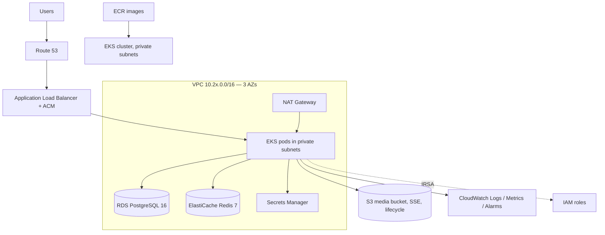
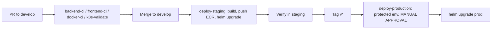

# SafeCity — Kubernetes and AWS

Two independent deployment paths are delivered:

| Path | Location | Purpose |
|------|----------|---------|
| **Helm** | `infrastructure/helm/safecity` | The supported Kubernetes deployment (dev/staging/prod overlays) |
| **Terraform** | `infrastructure/terraform` | AWS infrastructure: VPC, EKS, RDS, ElastiCache, S3, IAM, ALB, CloudWatch, Secrets |

> ⚠️ **Nothing here has been applied.** The Terraform modules are written and reviewed,
> but no AWS resource exists. `make terraform-apply` and `make terraform-destroy`
> deliberately refuse to run. Read [COST-CONTROL.md](COST-CONTROL.md) before creating
> anything — an EKS cluster plus a NAT gateway costs real money per hour, whether or not
> anyone uses it.

---

## 1. Helm chart

```
infrastructure/helm/safecity/
├── Chart.yaml
├── .helmignore
├── values.yaml               # defaults: conservative, production-shaped
├── values-dev.yaml           # 1 replica per tier, no autoscaling
├── values-staging.yaml       # mirrors prod shape, smaller
├── values-prod.yaml          # 3 replicas, autoscaling, existingSecret
└── templates/
    ├── _helpers.tpl          # names, labels, image ref, env, secret refs
    ├── serviceaccount.yaml   # IRSA trust anchor
    ├── configmap.yaml        # non-secret configuration
    ├── secret-django.yaml    # Secret TEMPLATE only
    ├── backend-deployment.yaml     # Deployment + Service (Daphne, HTTP + WS)
    ├── frontend-deployment.yaml    # Deployment + Service (nginx)
    ├── celery-deployment.yaml      # worker Deployment + beat Deployment
    ├── migration-job.yaml          # pre-install/pre-upgrade Helm hook
    ├── ingress.yaml                # per-path routing to backend / frontend
    ├── hpa-pdb.yaml                # HPAs + PodDisruptionBudgets
    └── networkpolicy.yaml          # default-deny + explicit allows
```

### Design decisions worth knowing

| Decision | Reason |
|----------|--------|
| **No PostgreSQL or Redis templates** | They are expected to be managed services (RDS + ElastiCache). The `safecity.dbHost` and `safecity.redisUrl` helpers use `required`, so a missing endpoint fails at render time with a readable message instead of producing a Service name that does not exist and a CrashLoopBackOff. |
| **Migrations are a Helm hook, not an entrypoint** | `pre-install,pre-upgrade` with `hook-weight: -5`. N replicas racing the same migration is a real failure mode; a broken migration aborts the release instead of shipping a half-upgraded app. |
| **Liveness hits `/api/health/`, readiness hits `/api/readiness/`** | Liveness checks no dependency. Probing readiness for liveness turns a database blip into a cluster-wide crash loop. |
| **Celery beat is `Recreate`, 1 replica** | Two schedulers both fire every scheduled job, double-counting SLA breaches and raising duplicate escalations. Recreate guarantees it is never momentarily 2. |
| **`/api`, `/ws`, `/admin` route at the Ingress** | The frontend image's `nginx.conf` proxies those paths to a hardcoded upstream named `backend`, which does not exist in Kubernetes (the Service is `<release>-safecity-backend`). Routing at the Ingress means that baked-in `proxy_pass` is never exercised. |
| **`checksum/config` and `checksum/secret` pod annotations** | Without them, editing a ConfigMap or Secret leaves running pods on stale values — a genuinely confusing bug to chase. |
| **Frontend runs as root by default** | The shipped `nginx:1.27-alpine` image's master process needs root to bind `:80`. See [§2](#2-frontend-hardening). Not a good default for production; it is a good default for "works with the image as built". |

### Install

```bash
# Render and inspect WITHOUT touching the cluster
helm template safecity infrastructure/helm/safecity \
  -f infrastructure/helm/safecity/values-dev.yaml \
  --set secret.secretKey=dev-only-not-a-real-secret \
  --set secret.postgresPassword=dev-only-not-a-real-secret > /tmp/safecity.rendered.yaml

# Lint
helm lint infrastructure/helm/safecity -f infrastructure/helm/safecity/values-dev.yaml

# Install (matches `make k8s-deploy`)
helm upgrade --install safecity infrastructure/helm/safecity \
  -f infrastructure/helm/safecity/values-dev.yaml \
  -n safecity-dev --create-namespace \
  --set secret.secretKey="$DJANGO_SECRET_KEY" \
  --set secret.postgresPassword="$POSTGRES_PASSWORD"
```

Always `helm template` before `helm upgrade --install`. A rendered manifest is readable;
a failed rollout at 2 a.m. is not.

### Secrets

Two supported patterns, and in staging/production the second is mandatory:

1. **`--set` at deploy time** from CI secrets. Usable, but values passed this way land in
   the Helm release history unless `--history-max` and a scrubbing step are configured.
   Acceptable for dev.
2. **`secret.existingSecret`** pointing at a Secret managed by External Secrets Operator
   syncing from AWS Secrets Manager. The chart renders no Secret at all. This is what
   `values-staging.yaml` and `values-prod.yaml` do.

`secret.secretKey` and `secret.postgresPassword` use `required` when the chart renders its
own Secret, so a release with an empty `SECRET_KEY` fails immediately rather than starting
pods with a blank signing key.

### Overlay contents

| | dev | staging | prod |
|---|---|---|---|
| backend replicas | 1 | 2–4 (HPA) | 3–10 (HPA) |
| frontend replicas | 1 | 2–4 (HPA) | 3–8 (HPA) |
| celery worker | 1 × 2 concurrency | 1 × 2 | 2–6 (HPA) × 4 |
| PDBs | off | on, `minAvailable: 1` | on, `minAvailable: 2` |
| Secrets | `--set` | `existingSecret` | `existingSecret` |
| TLS | off | on | on, forced redirect |
| DB / Redis | single-AZ | multi-AZ | multi-AZ |
| Node capacity | SPOT | on-demand | on-demand |

---

## 2. Frontend hardening

The chart defaults `frontend.unprivileged: false`, which means the nginx master process
runs as root with the capability set reduced to `NET_BIND_SERVICE` alone and a read-only
root filesystem. That is "as hardened as this image allows", not "hardened".

To run the frontend as a genuinely non-root container, rebuild the image on
`nginxinc/nginx-unprivileged` so it listens on **8080**, then set:

```yaml
frontend:
  unprivileged: true          # uid 101, no capabilities, port 8080
```

The chart switches the container port, the security contexts, and the Service
`targetPort` (which uses the named port `http`, so it follows automatically).

Rebuild recipe:

```dockerfile
FROM nginxinc/nginx-unprivileged:1.27-alpine AS runtime
COPY nginx.conf /etc/nginx/conf.d/default.conf   # change "listen 80" to "listen 8080"
COPY --from=build /app/dist /usr/share/nginx/html
EXPOSE 8080
```

This is tracked as a known limitation; the container currently ships as root.

---

## 3. Helm validation status

`helm lint` and `helm template` are the documented gates for this chart (Milestone 12:
"helm lint + kubeconform pass"). **Helm was not available in the environment where this
chart was reconstructed**, so the following was verified instead:

- ✅ Every `values*.yaml` and `Chart.yaml` parses as valid YAML
- ✅ Go template delimiters balance in all 11 template files
- ✅ Default values match the env vars the application actually reads
  (cross-checked against `.env.example` and `config/settings/base.py`)
- ❌ `helm lint` — not run
- ❌ `helm template` — not run
- ❌ `kubeconform` schema validation — not run

Run all three before deploying. This is exactly the kind of check the `k8s-validate.yml`
CI workflow is meant to automate.

---

## 4. Kubernetes concerns that are easy to get wrong

| Concern | Why it matters here |
|---------|---------------------|
| **WebSocket idle timeout** | The Channels endpoint at `/ws/notifications/` is long-lived. Both nginx-ingress (`proxy-read-timeout: 3600`) and ALB (`idle_timeout.timeout_seconds=3600`) drop connections at their default 60 s idle timeout, which looks like random disconnects. The overlays set these explicitly. |
| **Upload size** | Media uploads allow video up to 100 MB. The ingress body limit must exceed it (`proxy-body-size: 110m`), and it must be at least as large as nginx's `client_max_body_size` in the frontend image. |
| **Read-only root filesystem** | `readOnlyRootFilesystem: true` means `/tmp`, `/var/cache/nginx` and `/var/run` must be writable `emptyDir` mounts. Without them nginx and Daphne fail at startup with permission errors. |
| **NetworkPolicy enforcement** | These objects do nothing unless the CNI enforces them (Calico, Cilium, or AWS VPC CNI network policies). On a cluster whose CNI ignores them, they apply cleanly and enforce nothing — a silent no-op. |
| **DNS egress** | A default-deny policy that forgets port 53 breaks every name lookup. The chart ships an explicit DNS allow for this reason. |
| **SPOT nodes in staging** | A reclaimed node mid-test produces failures that look like application bugs. Staging and prod use on-demand. |
| **Kubernetes API exposure** | `cluster_public_access_cidrs` must be restricted. Left at `0.0.0.0/0` it exposes the control plane to the internet. The prod example lists GitHub Actions egress ranges plus the ops VPN. |

---

## 5. AWS architecture



### Terraform layout

```
infrastructure/terraform/
├── versions.tf                 # project-wide constraints (documentation; see note)
├── backend.tf.example          # S3 + DynamoDB remote state
├── modules/                    # network, ecr, eks, rds, elasticache,
│                               # s3, iam, cloudwatch, alb, secrets
└── environments/{dev,staging,prod}/
    ├── main.tf  variables.tf  outputs.tf  providers.tf  versions.tf
    └── terraform.tfvars.example
```

Each environment pins the same provider versions in its own `versions.tf`, because
Terraform only reads `.tf` files from the working directory. The root file records the
project-wide policy; the per-environment files are what `terraform init` enforces.

### Two-phase IAM

The `iam` module is called **twice** per environment. Node and cluster roles must exist
before EKS, but the IRSA role needs the cluster's OIDC provider, which only exists after
it. `create_eks_roles` and `enable_irsa` gate the two halves:

```
network → ecr → s3 → secrets → rds → elasticache
        → iam (create_eks_roles = true,  enable_irsa = false)
        → eks
        → iam (create_eks_roles = false, enable_irsa = true)
        → alb → cloudwatch
```

Without this split the graph is circular and Terraform cannot plan it.

### Environment sizing (from `terraform.tfvars.example`)

| Setting | dev | staging | prod |
|---------|-----|---------|------|
| VPC CIDR | `10.20.0.0/16` | `10.21.0.0/16` | `10.22.0.0/16` |
| NAT gateways | 1 shared | per-AZ | per-AZ |
| RDS instance | `db.t4g.micro` | `db.t4g.small` | `db.t4g.medium` |
| RDS multi-AZ | no | yes | yes |
| RDS backup retention | 0 days | 7 days | 30 days |
| RDS deletion protection | no | yes | yes |
| ElastiCache | single node | multi-AZ, 3-day snapshots | multi-AZ, 7-day snapshots |
| EKS nodes | 2 × `t3.medium` **SPOT** | 2–4 × `t3.medium` on-demand | 3–6 × `t3.medium` on-demand |
| ALB deletion protection | no | yes | yes |
| Region | `ap-south-1` (Mumbai) | same | same |

### Credentials

There are **no long-lived AWS access keys anywhere** in this design:

- CI authenticates to AWS via GitHub Actions OIDC into a repository-scoped role.
- Pods authenticate via IRSA (the ServiceAccount annotation) for S3 and Secrets Manager.
- The generated database password lives in Secrets Manager, never in `terraform.tfvars`.

### Usage

```bash
cd infrastructure/terraform/environments/dev
cp terraform.tfvars.example terraform.tfvars    # edit it
terraform init
terraform fmt -check -recursive
terraform validate
terraform plan -out=dev.tfplan                  # READ THE PLAN
```

Only then, and only deliberately:

```bash
terraform apply dev.tfplan
```

Run everything from an environment directory. `terraform fmt -check -recursive` and
`validate` are the CI gates; both are safe and neither creates anything.

### Remote state

Local state is fine for a first look and unsafe the moment two people apply. State also
contains the generated database password, so the bucket must be private and access
restricted to the CI role and operators.

The bootstrap commands (bucket, versioning, encryption, lock table) are in
`infrastructure/terraform/README.md`. Terraform cannot manage the backend it is currently
using, so bootstrap is a deliberate manual step.

### Destroy

`terraform destroy` is destructive and irreversible. Production sets
`deletion_protection` and `prevent_destroy` on the database and media bucket, so those
must be removed deliberately before they can be destroyed. The ordered production
teardown procedure is in [COST-CONTROL.md](COST-CONTROL.md).

---

## 6. The Kustomize gap

`docs/ARCHITECTURE.md` §11 mentions plain Kustomize overlays as an alternative for teams
that prefer manifests to Helm. `infrastructure/kubernetes/` exists but is **empty** —
`{base,overlays/{dev,staging,production}}` were never written.

Helm is the delivered and supported path. The Kustomize directory is either future work
or should be removed; an empty directory implies a deliverable that does not exist.

---

## 7. Deployment flow (intended)



Neither `deploy-staging.yml` nor `deploy-production.yml` exists yet — `.github/workflows/`
is empty. Until they do, deployment is manual and must be performed with `helm template`
reviewed first.
