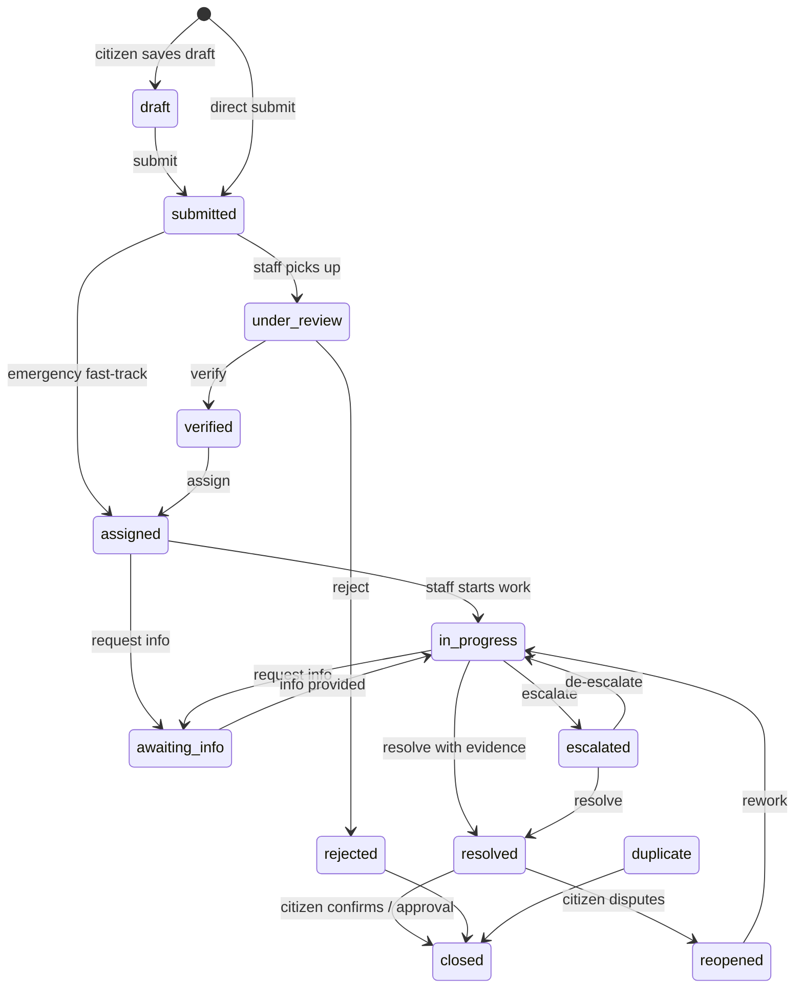
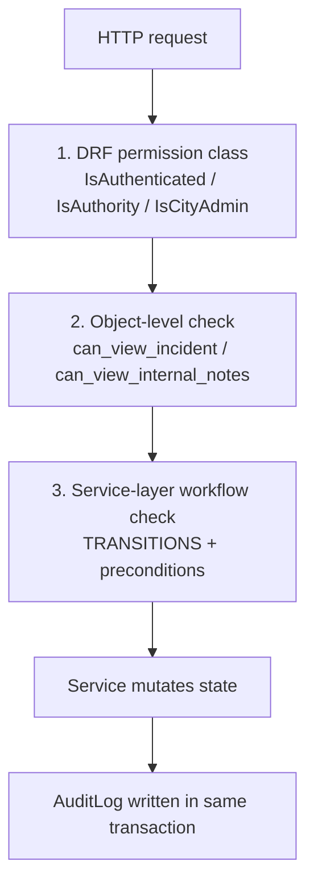

# SafeCity — Roles and Access Control

SafeCity decides authorization **entirely on the server**. The frontend route guards
are a usability affordance; they are never the security boundary. Every endpoint
re-checks the caller's role and, where relevant, their relationship to the specific
object.

---

## 1. Roles

Roles are a single primary value on `User.role` (`apps/accounts/models.py`,
`UserRole`), plus a matching Django group created by `sync_roles`.

| Role key | Display name | Django group | Purpose |
|----------|--------------|--------------|---------|
| `citizen` | Citizen | `citizens` | Report incidents, track them, give feedback |
| `volunteer` | Volunteer | `volunteers` | Observe and support verified community incidents |
| `department_staff` | Department Staff | `department-staff` | Work the department's incident queue |
| `emergency_responder` | Emergency Responder | `emergency-responders` | Handle high-severity and emergency incidents |
| `city_admin` | City Administrator | `city-admins` | Configure the platform, manage people, see everything |
| `superuser` | Superuser | `superusers` | Full control; provisioned, not self-registered |

A user belongs to **exactly one** primary role. `city_admin` and `superuser` differ in
provisioning and Django-admin access rather than in operational authority — both are
treated as "authority" by `User.is_authority()` and as unscoped by the permission
helpers.

`User.is_authority()` returns `True` for `department_staff`, `emergency_responder`,
`city_admin`, and `superuser`. That predicate is the single definition of "may act on
incidents".

---

## 2. Permission classes

Declared in `apps/accounts/permissions.py`.

| Class | Grants when |
|-------|-------------|
| `IsAuthenticatedRole` | Caller is authenticated |
| `IsCitizen` | `role == citizen` |
| `IsDepartmentStaff` | `role == department_staff` |
| `IsCityAdmin` | `role in {city_admin, superuser}` |
| `IsAuthority` | `user.is_authority()` |
| `CanViewIncident` | `can_view_incident(user, obj)` — object-level |

### Object-level helpers

`can_view_incident(user, incident)`:

- Unauthenticated → true only for public statuses (`verified`, `resolved`).
- Admin / superuser → everything.
- Reporter → always, including their own anonymous reports.
- Department staff → incidents belonging to their department.
- Emergency responder → incidents assigned to them, **or** with severity
  `high`/`critical`, **or** flagged `is_emergency`.
- Volunteer → incidents in `verified`, `in_progress`, or `resolved`.
- Anyone else → public statuses only.

Privacy redaction is deliberately **not** part of this function. An authorized viewer
still receives a redacted payload if the serializer is a public one; visibility and
redaction are separate concerns.

`can_view_internal_notes(user, incident)`:

- Authority only, narrowed to admins/superusers, the owning department, or the
  assigned staff member/responder.

`can_manage_users(user)`:

- `role in {city_admin, superuser}`.

---

## 3. Capability matrix

Enforced by permission classes, the transition matrix, and object checks together.
`✳` marks a capability that additionally depends on object-level relationship.

| Capability | Citizen | Volunteer | Dept Staff | Responder | City Admin | Superuser |
|---|:-:|:-:|:-:|:-:|:-:|:-:|
| Register / log in | ✅ | ✅ | ✅ | ✅ | ✅ | — provisioned |
| Create incident | ✅ | — | ✅ | — | ✅ | ✅ |
| Report anonymously (config) | ✅ | — | — | — | ✅ | ✅ |
| View own incidents | ✅ | — | ✅ | ✅ | ✅ | ✅ |
| View department incidents | — | — | ✅ ✳ | ✅ ✳ | ✅ | ✅ |
| View verified community incidents | — | ✅ | ✅ | ✅ | ✅ | ✅ |
| Verify / reject incident | — | — | ✅ | — | ✅ | ✅ |
| Move to in-progress | — | — | ✅ | ✅ ✳ | ✅ | ✅ |
| Assign / reassign | — | — | ✅ ✳ | — | ✅ | ✅ |
| Escalate | — | — | ✅ | ✅ | ✅ | ✅ |
| Merge duplicates | — | — | — | — | ✅ | ✅ |
| Reopen (own incident) | ✅ ✳ | — | ✅ | — | ✅ | ✅ |
| Resolve with evidence | — | — | ✅ | ✅ ✳ | ✅ | ✅ |
| Close after resolution | — | — | ✅ | — | ✅ | ✅ |
| Confirm resolution | ✅ ✳ | — | — | — | ✅ | ✅ |
| Satisfaction rating | ✅ ✳ | — | — | — | — | — |
| View internal notes / timeline | — | — | ✅ ✳ | ✅ ✳ | ✅ | ✅ |
| Public comment | ✅ ✳ | ✅ ✳ | ✅ | ✅ | ✅ | ✅ |
| View analytics | — | — | ✅ dept-scoped | ✅ limited | ✅ all | ✅ all |
| Export analytics CSV | — | — | ✅ dept-scoped | ✅ limited | ✅ all | ✅ all |
| Manage users / roles | — | — | — | — | ✅ | ✅ |
| Process deletion requests | — | — | — | — | ✅ | ✅ |
| Manage departments / categories / SLA / wards | — | — | — | — | ✅ | ✅ |
| Manage announcements | — | — | — | — | ✅ | ✅ |
| Read audit logs | — | — | — | — | ✅ | ✅ |
| Publish announcements | — | — | — | — | ✅ | ✅ |
| AI suggestions | — | — | ✅ | ✅ | ✅ | ✅ |
| **Bypass audit logging** | ❌ | ❌ | ❌ | ❌ | ❌ | ❌ |

### Analytics scoping (`apps/analytics/views.py` `_scope_queryset`)

| Role | Sees |
|------|------|
| Citizen | HTTP 403 — analytics are not citizen-facing |
| Department staff | Incidents in their own department |
| Emergency responder | Incidents assigned to them, plus all `high`/`critical` |
| City admin / superuser | All non-deleted incidents |

---

## 4. The workflow transition matrix

Authorization for status changes is **data**, not scattered `if` statements. The matrix
lives in `apps/incidents/services.py` as `TRANSITIONS`, keyed by
`from_status → {to_status: {allowed_roles}}`.

| From | To | Allowed roles |
|------|----|---------------|
| `draft` | `submitted` | citizen, city_admin, superuser |
| `submitted` | `under_review` | department_staff, city_admin, superuser |
| `submitted` | `verified` / `rejected` / `duplicate` | city_admin, superuser |
| `submitted` | `assigned` (emergency fast-track) | city_admin, superuser, department_staff |
| `under_review` | `verified` / `rejected` | department_staff, city_admin, superuser |
| `under_review` | `duplicate` | city_admin, superuser |
| `verified` | `assigned` | city_admin, superuser, department_staff |
| `assigned` | `in_progress` | department_staff, city_admin, superuser, emergency_responder |
| `assigned` | `awaiting_info` | department_staff, city_admin, superuser |
| `assigned` | `reopened` | city_admin, superuser |
| `in_progress` | `awaiting_info` | department_staff, city_admin, superuser |
| `in_progress` | `resolved` | department_staff, city_admin, superuser, emergency_responder |
| `in_progress` | `escalated` | department_staff, city_admin, superuser, emergency_responder |
| `in_progress` | `assigned` (reassignment) | city_admin, superuser |
| `awaiting_info` | `in_progress` | citizen, department_staff, city_admin, superuser |
| `awaiting_info` | `escalated` | city_admin, superuser |
| `escalated` | `in_progress` | department_staff, city_admin, superuser, emergency_responder |
| `escalated` | `resolved` | department_staff, city_admin, superuser |
| `resolved` | `closed` | department_staff, city_admin, superuser |
| `resolved` | `reopened` | citizen, city_admin, superuser |
| `reopened` | `in_progress` | department_staff, city_admin, superuser |
| `reopened` | `assigned` | city_admin, superuser |
| `rejected` | `closed` | city_admin, superuser |
| `duplicate` | `closed` | city_admin, superuser |

Any pair absent from the table is forbidden. `change_status()` is the only sanctioned
way to move an incident, and it enforces the matrix before writing anything.

---

## 5. The three enforcement layers

No layer trusts the one before it for a *different* question:

1. **Permission class** answers "what kind of user is this?".
2. **Object check** answers "may this user touch *this row*?".
3. **Service check** answers "is this transition legal from the current state?".

Because layer 3 runs inside the transaction, a transition cannot be half-applied:
the matrix check, state mutation, history row, audit row, and notification fan-out all
commit or roll back together.

---

## 6. Why this design

| Decision | Reason |
|----------|--------|
| Single primary role instead of a role set | Members of a municipality have one job function; composite permissions are expressed through Django groups, avoiding the classic "which role wins?" ambiguity. |
| Authorization in services, not views | A workflow rule enforced in a view can be bypassed by any other entry point (management command, Celery task, admin action). Putting it in the service makes the matrix the single source of truth. |
| Frontend guards are cosmetic | Route guards keep users out of dead ends; they are trivially bypassed by editing localStorage, so they are never relied on. |
| Audit is not role-exempt | A platform where a privileged account can silently edit state has no meaningful audit story. |

---

## 7. Current gaps

Documented honestly rather than omitted — see
[Known limitations](PROJECT-MANAGEMENT.md#2-known-limitations):

- **`ROLE_PERMISSIONS` is empty.** `apps/accounts/roles.py` defines the mapping
  structure and `sync_roles` populates the groups, but no permission codenames are
  mapped yet. Role enforcement today comes from the explicit permission classes and the
  transition matrix, not from group permissions. `sync_roles` is therefore a no-op
  beyond group creation.
- **No automated RBAC regression gate in CI** — `backend/tests/test_rbac.py` exists and
  parametrizes over the role matrix, but the workflow that would run it on every PR is
  not yet in place.
