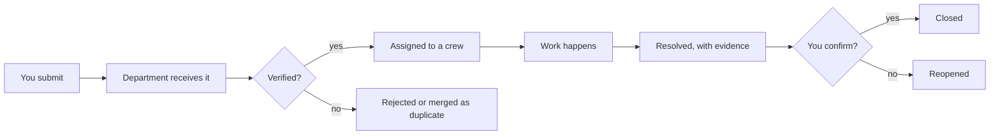

# SafeCity — User Manual

For citizens, volunteers, department staff and emergency responders.

> ⚠️ SafeCity is an **incident coordination tool**, not an emergency service. In a real
> emergency, call your local emergency number.

**Contents:** [Getting started](#1-getting-started) · [Citizen guide](#2-citizen-guide) ·
[Volunteer guide](#3-volunteer-guide) · [Staff guide](#4-department-staff-guide) ·
[Responder guide](#5-emergency-responder-guide) · [Notifications](#6-notifications) ·
[Understanding status](#7-understanding-incident-status) ·
[Privacy](#8-your-privacy) · [FAQ](#9-frequently-asked-questions)

---

## 1. Getting started

### Public pages (no account needed)

| Page | Path | What it does |
|------|------|--------------|
| Home | `/` | Overview and entry points |
| About | `/about` | What SafeCity is, and what it is not |
| Public map | `/map` | Incidents in your area |
| Track an incident | `/track` | Look up a report by its reference number |
| Announcements | `/announcements` | City notices |
| Log in | `/login` | — |
| Register | `/register` | Create a citizen account |
| Forgot password | `/forgot-password` | Reset a forgotten password |

### Creating an account

1. Open `/register`.
2. Enter your email, a password, and your name.
3. Submit. You are signed in and land on your dashboard.

Your email address **is** your login. It is never shown to other citizens and is excluded
from every public view of your reports.

### Signing in

Open `/login` and enter your email and password. Your session lasts 7 days; the access
credential behind it is renewed automatically. If you are idle long enough to be signed
out, sign in again — you will not lose a draft report.

> **Locked out?** After repeated failed attempts the account locks temporarily. Wait for
> the lockout to expire rather than retrying, which extends it.

---

## 2. Citizen guide

### 2.1 Your dashboard

`/dashboard` shows your active and resolved reports, status cards, and a shortcut to
report something new.

### 2.2 Reporting an incident

Open **Report an incident** (`/report`). The wizard has **seven steps**, and you can go
back at any point before submitting.

| Step | What to do | Notes |
|------|-----------|-------|
| 1. **Category & title** | Pick the category that fits best, then a short title | The category decides which department receives the report |
| 2. **Description** | Describe what you see, and where exactly | Include landmarks. Specific detail speeds verification |
| 3. **Location** | Click the map to drop a pin | Use the public address line for something shareable; the precise point stays authority-only |
| 4. **Severity** | Choose Low, Medium, High or Critical; set urgency | Be honest — inflating severity does not speed up real work, and it hides genuine emergencies |
| 5. **Media** | Attach photos, video or documents | Images ≤ 10 MB, video ≤ 100 MB, documents ≤ 5 MB; JPEG/PNG/WebP/HEIC. Some categories require a photo |
| 6. **Options** | Report anonymously if needed | Anonymous reports hide your identity from everyone, including authorities |
| 7. **Review** | Check everything, then submit | — |

On submit you receive a **reference number** in the form `SC-MUM-2026-000042`. **Write it
down.** It is how you and anyone else can track the report.

#### Tips that get reports resolved faster

- **One issue per report.** A combined "pothole and broken streetlight" report cannot be
  assigned sensibly — they go to different departments.
- **Attach a photo.** Visual evidence is the difference between verification in minutes
  and a site visit.
- **Use a landmark.** "Opposite the bus stop on Linking Road" is more useful than precise
  coordinates alone.
- **Check the map first.** If someone has already reported the same thing, your report may
  be merged as a duplicate — which is helpful, not a failure: it adds weight to the
  original.

#### Reporting anonymously

Turn on **Report anonymously** at step 6. Your account is not linked to the incident, and
no authority — not even an administrator — can see who filed it. The trade-off is that you
will not receive status notifications for it, because the system no longer knows who to
notify. Keep the reference number if you want to follow it.

#### What happens after you submit

### 2.3 Tracking your reports

**My incidents** (`/incidents`) lists everything you have reported, with current status
and how long each has been open. Open any one to see:

- the **timeline** of status changes,
- **media** you and the authority attached,
- **comments**, including public updates,
- the **SLA deadline** — when it should be done by.

### 2.4 Tracking without an account

Anyone can track a report at `/track` using the reference number. That public view shows
status and progress but strips your identity, your private address, internal notes, and
pins the location only approximately (within about 150 m). This is deliberate: a public
tracking page must not become a way to find out who reported what, and where they live.

### 2.5 When it is resolved

You are notified when a report is marked **Resolved**. You can then:

- **Confirm** — closes it, and you can leave a 1–5 rating and a comment.
- **Reopen** — if the fix is not real. A short reason helps: "still flooding after rain"
  is more actionable than "not fixed".

Reopening is a normal part of the process, not a complaint. Resolution is evidence-based,
and evidence can be wrong.

### 2.6 Notifications

`/notifications` lists updates. See [§6](#6-notifications).

### 2.7 Profile and saved locations

`/profile` lets you:

- update your name, phone, and language,
- control notification channels,
- save frequent locations ("Home", "Work") to speed up future reports,
- review your consent records,
- request account deletion.

---

## 3. Volunteer guide

Volunteers support verified community incidents without the authority to change workflow
state.

| You can | You cannot |
|---------|-----------|
| See incidents that are Verified, In Progress, or Resolved | See reports awaiting verification |
| Add public comments and observations | See citizen identities or contact details |
| Track community activity on the map | Read internal authority notes |
| | Verify, assign, escalate, or resolve |

Use public comments for genuinely useful, specific information: "This stretch floods every
monsoon for about 40 m." Forward speculation and opinions elsewhere — comments are visible
to citizens and to the department.

---

## 4. Department staff guide

### 4.1 Operations dashboard

`/operations` shows KPIs for **your department**: open incidents, awaiting verification,
high priority, overdue, emergency count, average response and resolution times, and SLA
compliance.

### 4.2 Working the queue

`/queue` is your work list. It shows only your department's incidents.

- Filter and search; save frequently used filters.
- Sort by severity, urgency, SLA deadline, or age.
- Overdue incidents are flagged, not hidden. The queue is meant to make the backlog
  visible, not to bury it.

**Priority order is severity and deadline, not arrival.** An urgent water leak
outranks a routine road-marking request that arrived earlier, and the interface does not
let that ordering be quietly ignored.

### 4.3 The workflow panel

Open an incident, then use the actions available at its current status. You cannot perform
an action that is not legal from where the incident is — the server rejects it, and the
button will not be offered.

| Action | Moves the incident to | Notes |
|--------|----------------------|-------|
| **Start review** | Under Review | Claim it |
| **Verify** | Verified | You have confirmed it is real |
| **Reject** | Rejected | Invalid, out of scope, or abuse. Give a reason |
| **Assign** | Assigned | Pick a colleague, or let workload-aware assignment choose the least-loaded |
| **Start work** | In Progress | — |
| **Request information** | Awaiting Information | Ask the citizen a specific question |
| **Escalate** | Escalated | Record a level and a reason |
| **Resolve** | Resolved | **A summary and evidence are required** |
| **Close** | Closed | After resolution |
| **Merge** | Duplicate | Admin only |

#### Adding internal notes

Comments marked **internal** are for authority eyes only. Use them for candid operational
context: access constraints, crew availability, a disagreement about scope. Internal notes
never appear in public views or public tracking pages.

> Internal notes are discoverable in audit and litigation contexts. Write them as you would
> write a professional record, not as a private aside.

### 4.4 Resolving with evidence

Resolution requires a summary and supporting evidence. This is not bureaucracy — a
resolution that cannot be inspected is indistinguishable from a closed ticket, and the
citizen can reopen it precisely because they can see that.

Write the summary for someone reading it in six months: what was actually done, on what
date, with what material.

### 4.5 Escalation

Escalate when you are blocked by something outside your control: a part is unavailable, the
issue crosses departmental boundaries, or the deadline is at risk.

| Level | Goes to |
|-------|---------|
| Level 1 | Supervisor |
| Level 2 | Department head |
| Level 3 | Emergency operations |

Escalating is not a failure on your part. An escalation sweep automatically raises
escalations on stale and overdue work, so the escalation you file pre-empts one the system
would have filed for you.

### 4.6 Reassignment

Reassign when someone else is better placed to do the work. Assignment history is retained,
so it is always answerable who held an incident when.

---

## 5. Emergency responder guide

Responders see:

- incidents **assigned to them**,
- all **high and critical severity** incidents,
- all incidents flagged **emergency**.

| You can | You cannot |
|---------|-----------|
| Move assigned incidents to In Progress, Resolved, or Escalated | Reassign work to other people |
| Escalate | Verify or reject reports |
| See internal notes on your incidents | Manage users or configuration |

An emergency incident moves into the queue immediately and is fast-tracked, so a report
that would normally wait for verification is visible at once. That speed is deliberate —
which is also why marking something as an emergency when it is not is a genuine harm to
someone else's response time.

---

## 6. Notifications

SafeCity notifies you about events relevant to you, as they happen:

| Event | Who is notified |
|-------|-----------------|
| Report submitted | Reporter (unless anonymous) |
| Verified / rejected | Reporter |
| Assigned | Assignee |
| Status change | Reporter and assignee |
| Information requested | Reporter |
| Escalated | Escalation group |
| Resolved | Reporter |
| Reopened | Assignee and department |
| Announcement published | Audience |
| SLA breach | Department staff |

Manage channels in `/profile` → notification preferences. Each channel (in-app, email,
SMS, push) can be toggled, and specific events can be muted individually.

> **In-app notifications are the reliable channel today.** Email works when SMTP is
> configured; SMS and push are provider interfaces without a configured backend, and the
> realtime WebSocket client is not yet wired in the browser. If something seems missing,
> check `/notifications` — see [Known limitations](PROJECT-MANAGEMENT.md#2-known-limitations).

---

## 7. Understanding incident status

| Status | Meaning to you |
|--------|----------------|
| **Draft** | Saved but not submitted; nobody has seen it yet |
| **Submitted** | Received and queued for the department |
| **Under Review** | A staff member is looking at it |
| **Verified** | Confirmed as real and actionable |
| **Rejected** | Not actioned — invalid, out of scope, or duplicate |
| **Duplicate** | Merged into an existing report |
| **Assigned** | Given to a specific person or crew |
| **In Progress** | Actively being worked |
| **Awaiting Information** | Waiting on a reply from you — check your notifications |
| **Escalated** | Raised to a supervisor because it is blocked or overdue |
| **Resolved** | Work complete, with evidence. **Confirm or reopen it** |
| **Closed** | Confirmed done and closed |
| **Reopened** | You disputed the resolution; back in the queue |

**Most useful statuses to watch:** *Awaiting Information* (it needs you, and it will not
move until you respond) and *Resolved* (only you can close it).

---

## 8. Your privacy

| What SafeCity does | Why |
|--------------------|-----|
| Hides your identity from every public view | A public incident map must not identify reporters |
| Jitters public coordinates by ~150 m | Prevents a public page locating your home |
| Keeps your precise location authority-only | Authorities need it; the public does not |
| Uses unguessable links for public sharing | A reference number alone must not expose a report |
| Hides internal notes from you and the public | Operational detail, not citizen information |
| Separates anonymous reports from your account | Anonymity that can be reversed is not anonymity |
| Records your consent per policy version | Consent you cannot audit is not consent |

### Account deletion

Request deletion from `/profile`. An administrator processes the request and your personal
details are anonymized. Records of what happened operationally — an incident, a status
change, who acted — are retained in a form that no longer identifies you.

This is a deliberate balance. Erasing the audit trail entirely would let anyone with a
temporary session destroy accountability for past actions.

### Reporting safely

If a report could identify you and that is a risk — for example a safety hazard at your
own residence — use **anonymous reporting**. Nothing about the report will be linked to
your account.

---

## 9. Frequently asked questions

**I cannot log in.**
Check your email for typos, and note that accounts lock temporarily after repeated
failures. Password reset is at `/forgot-password`.

**I lost my reference number.**
Sign in and open `/incidents` — your reports are listed. Anonymous reports cannot be
retrieved this way, which is the cost of anonymity.

**Can I report for someone else?**
Yes, if they are with you and consent. Report it from your own account and describe the
situation. Do not file under someone else's identity.

**Why is my report still "Submitted"?**
It is queued for verification. Departments have limited staff; the SLA deadline shown on
the incident is the commitment, and it is visible to you deliberately.

**Why was my report rejected?**
Commonly: it duplicated an existing report, it was outside the platform's scope, or it was
not a civic incident. Rejections should include a reason — if yours does not, ask in a
comment.

**Why was my report merged with another?**
Both described the same event. Merging keeps one work item and one history instead of two
competing tickets, and preserves your report as a supporting data point.

**The problem came back. What now?**
Reopen the incident from its detail page with the reason. That carries the original
context forward, which is more useful than filing a new report.

**Can I edit a report after submitting?**
Not the description; the record is deliberately immutable so the audit trail stays
trustworthy. Add a comment with the correction instead — it becomes part of the timeline.

**Why can I not see other citizens' reports?**
Only verified, in-progress and resolved incidents are visible to volunteers and the public,
and always without reporter identity. The rest are confidential to the department handling
them.

**Is my data used to train AI?**
No. The default AI provider is a mock that makes no external call, and free text is scrubbed
of direct identifiers before any external request. AI output is advisory only and never
changes an incident's status by itself.

**Can I see who is handling my report?**
You can see status and public comments. Individual staff identities are not exposed to
citizens, so that staff are not personally targeted over decisions they did not make alone.
